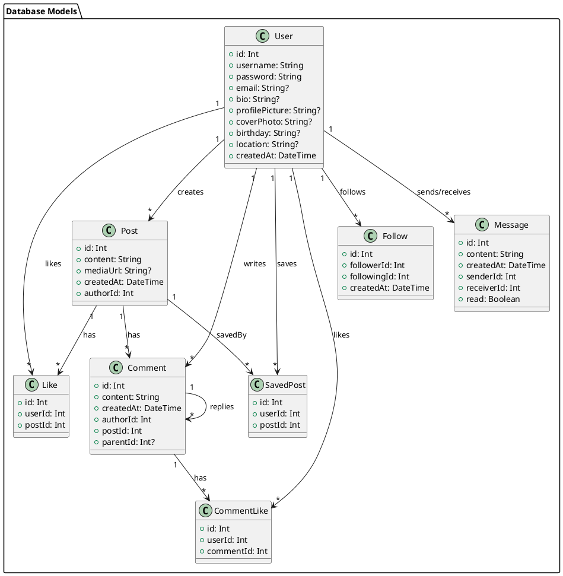
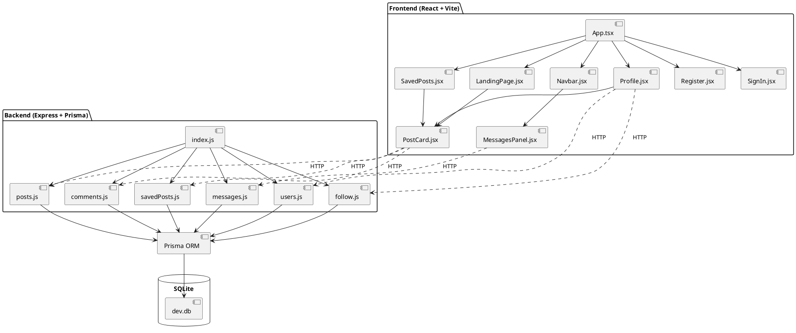

# Aurora Socials - Complete Architecture Documentation

## 🎯 Project Overview

**Aurora Socials** is a Facebook-style social media web application built with a modern JavaScript/TypeScript stack. It features user authentication, social feeds, posts with media, comments with threading, likes, follows, direct messaging, and user profiles.

---

## 🛠 Technology Stack

### Frontend
| Technology | Version | Purpose |
|------------|---------|---------|
| **React** | 19.2.0 | UI component library - handles rendering, state management, and component lifecycle |
| **Vite** | 7.2.4 | Build tool & dev server - provides fast HMR (Hot Module Replacement) and optimized builds |
| **TypeScript** | 5.9.3 | Type safety for JavaScript - catches errors at compile time |
| **React Router DOM** | 6.22.3 | Client-side routing - enables SPA navigation without page reloads |
| **Axios** | 1.13.2 | HTTP client - handles all API requests to the backend |
| **Tailwind CSS** | 4.1.18 | Utility-first CSS framework - rapid styling with utility classes |
| **React Icons** | (various) | Icon libraries including FontAwesome and Ionicons |

### Backend
| Technology | Version | Purpose |
|------------|---------|---------|
| **Node.js** | 25.3.0 | JavaScript runtime - executes server-side code |
| **Express** | 5.2.1 | Web framework - handles HTTP routing, middleware, and request/response |
| **Prisma ORM** | Latest | Database ORM - type-safe database queries and migrations |
| **SQLite** | - | Database - lightweight file-based relational database |
| **CORS** | 2.8.5 | Middleware - enables cross-origin requests from frontend |
| **Body Parser** | 2.2.2 | Middleware - parses JSON request bodies (up to 50MB for images) |

---

## 📁 Project Structure

```
Aurora socials/
├── src/                          # Frontend source code
│   ├── App.tsx                   # Main app component with routing
│   ├── main.tsx                  # React entry point
│   ├── index.css                 # Global styles
│   ├── api/
│   │   └── axios.js              # Axios instance configuration
│   └── assets/
│       └── components/           # React components
│           ├── Navbar.jsx        # Navigation bar (persistent)
│           ├── Register.jsx      # User registration page
│           ├── SignIn.jsx        # User login page
│           ├── LandingPage.jsx   # Main feed page
│           ├── Profile.jsx       # User profile page
│           ├── PostCard.jsx      # Reusable post component ⭐
│           ├── PostView.jsx      # Single post view
│           ├── SavedPosts.jsx    # Saved posts page
│           ├── Friends.jsx       # Friends list page
│           └── MessagesPanel.jsx # DM slide-out panel
│
├── server/                       # Backend source code
│   ├── index.js                  # Express app entry point
│   ├── routes/                   # API route handlers
│   │   ├── posts.js              # Post CRUD operations
│   │   ├── comments.js           # Comment operations
│   │   ├── users.js              # User profile operations
│   │   ├── savedPosts.js         # Save/unsave posts
│   │   ├── follow.js             # Follow/unfollow users
│   │   ├── friends.js            # Friend relationships
│   │   └── messages.js           # Direct messaging
│   └── prisma/
│       ├── schema.prisma         # Database schema definition
│       └── migrations/           # Database migrations
│
├── package.json                  # Dependencies & scripts
├── vite.config.ts                # Vite configuration
├── tailwind.config.cjs           # Tailwind CSS configuration
└── tsconfig.json                 # TypeScript configuration
```

---

## 🗄 Database Schema (Entity Relationship)

```
┌─────────────────────────────────────────────────────────────────────────────┐
│                              DATABASE SCHEMA                                 │
└─────────────────────────────────────────────────────────────────────────────┘

┌──────────────┐       ┌──────────────┐       ┌──────────────┐
│     USER     │       │     POST     │       │   COMMENT    │
├──────────────┤       ├──────────────┤       ├──────────────┤
│ id (PK)      │◄──────│ authorId(FK) │       │ id (PK)      │
│ username     │       │ id (PK)      │◄──────│ postId (FK)  │
│ password     │       │ content      │       │ authorId(FK) │──────►USER
│ email        │       │ mediaUrl     │       │ content      │
│ bio          │       │ createdAt    │       │ parentId(FK) │──┐ (self-ref)
│ profilePic   │       └──────────────┘       │ createdAt    │◄─┘
│ coverPhoto   │              │               └──────────────┘
│ birthday     │              │                      │
│ location     │              ▼                      ▼
│ createdAt    │       ┌──────────────┐       ┌──────────────┐
└──────────────┘       │     LIKE     │       │ COMMENTLIKE  │
       │               ├──────────────┤       ├──────────────┤
       │               │ id (PK)      │       │ id (PK)      │
       │               │ userId (FK)  │       │ userId (FK)  │
       │               │ postId (FK)  │       │ commentId(FK)│
       │               └──────────────┘       └──────────────┘
       │
       ├─────────────────────┬─────────────────────┐
       │                     │                     │
       ▼                     ▼                     ▼
┌──────────────┐       ┌──────────────┐       ┌──────────────┐
│  SAVEDPOST   │       │    FOLLOW    │       │   MESSAGE    │
├──────────────┤       ├──────────────┤       ├──────────────┤
│ id (PK)      │       │ id (PK)      │       │ id (PK)      │
│ userId (FK)  │       │ followerId   │       │ senderId(FK) │
│ postId (FK)  │       │ followingId  │       │ receiverId   │
└──────────────┘       │ createdAt    │       │ content      │
                       └──────────────┘       │ createdAt    │
                              │               │ read         │
                              │               └──────────────┘
                              ▼
                       ┌──────────────┐
                       │ FRIENDSHIP   │ (legacy/unused)
                       ├──────────────┤
                       │ id (PK)      │
                       │ senderId     │
                       │ receiverId   │
                       │ status       │
                       └──────────────┘
```

### Model Descriptions

| Model | Purpose | Key Relationships |
|-------|---------|-------------------|
| **User** | Stores user account and profile data | Has many: posts, likes, comments, follows, messages |
| **Post** | User-created content with optional media | Belongs to User, has many: likes, comments, savedBy |
| **Comment** | Comments on posts with threading support | Belongs to Post & User, self-referential for replies |
| **Like** | Post likes (one per user per post) | Belongs to User & Post |
| **CommentLike** | Comment likes with unique constraint | Belongs to User & Comment |
| **SavedPost** | Bookmarked posts | Belongs to User & Post |
| **Follow** | Directional follow relationship | Links follower → following User |
| **Message** | Direct messages between users | Links sender → receiver User |

---

## 🔌 API Endpoints

### Authentication (in `/server/index.js`)
| Method | Endpoint | Description |
|--------|----------|-------------|
| POST | `/api/register` | Create new user account |
| POST | `/api/login` | Authenticate user, returns userId |

### Posts (`/api/posts`)
| Method | Endpoint | Description |
|--------|----------|-------------|
| GET | `/` | Get feed posts (latest 20) with author, likes, comments |
| GET | `/:id` | Get single post by ID |
| POST | `/` | Create new post (requires userId, content, optional mediaUrl) |
| POST | `/:id/like` | Toggle like on post |
| DELETE | `/:id` | Delete post (author only) |

### Comments (`/api/comments`)
| Method | Endpoint | Description |
|--------|----------|-------------|
| POST | `/:id/comment` | Add comment to post (supports parentId for replies) |
| POST | `/:commentId/like` | Toggle like on comment |
| DELETE | `/:commentId` | Delete comment and its replies (author only) |

### Users (`/api/users`)
| Method | Endpoint | Description |
|--------|----------|-------------|
| GET | `/:id` | Get user profile with posts |
| PUT | `/:id` | Update user profile (bio, pictures, etc.) |

### Saved Posts (`/api/savedPosts`)
| Method | Endpoint | Description |
|--------|----------|-------------|
| GET | `/user/:userId` | Get all saved posts for user |
| POST | `/:id/save` | Toggle save/unsave post |

### Follow (`/api/follow`)
| Method | Endpoint | Description |
|--------|----------|-------------|
| POST | `/follow` | Follow a user |
| DELETE | `/unfollow` | Unfollow a user |
| GET | `/status/:followerId/:followingId` | Check if following |
| GET | `/followers/:userId` | Get user's followers |
| GET | `/following/:userId` | Get users being followed |

### Messages (`/api/messages`)
| Method | Endpoint | Description |
|--------|----------|-------------|
| GET | `/friends/:userId` | Get friends (mutual followers) |
| GET | `/followers/:userId` | Get user's followers |
| POST | `/send` | Send message (friends only) |
| GET | `/conversation/:userId/:otherUserId` | Get conversation between users |
| POST | `/read/:messageId` | Mark message as read |

---

## 🧩 Component Architecture

```
┌─────────────────────────────────────────────────────────────────────────────┐
│                           COMPONENT HIERARCHY                                │
└─────────────────────────────────────────────────────────────────────────────┘

App.tsx (Router)
├── Register.jsx ────────────────────► /
├── SignIn.jsx ──────────────────────► /signin
│
└── [Protected Routes with Navbar]
    ├── Navbar.jsx ◄─────────────────── (persistent, contains MessagesPanel)
    │   └── MessagesPanel.jsx ◄──────── (slide-out DM panel)
    │
    ├── LandingPage.jsx ─────────────► /feed
    │   └── PostCard.jsx (multiple) ◄── (reusable post component)
    │
    ├── Profile.jsx ─────────────────► /profile, /profile/:userId
    │   ├── PostCard.jsx (multiple)
    │   ├── FollowersModal (inline)
    │   └── FollowingModal (inline)
    │
    ├── SavedPosts.jsx ──────────────► /saved
    │   └── PostCard.jsx (multiple)
    │
    ├── PostView.jsx ────────────────► /post/:postId
    │   └── PostCard.jsx
    │
    └── Friends.jsx ─────────────────► /friends
```

### Key Component: PostCard.jsx ⭐
The **PostCard** is the central reusable component (~590 lines) that encapsulates:
- Post display (author info, content, media, timestamp)
- Like/Unlike functionality
- Save/Unsave functionality
- Expandable comments section
- Threaded comment replies
- Comment likes
- Share modal (copy link)
- Delete confirmation modal (for post author)
- Reply to comment functionality

**Props:**
```javascript
{
  post: Object,           // Post data with author, likes, comments
  currentUserId: Number,  // Logged-in user's ID
  onRefresh: Function,    // Callback to refresh parent's data
  injectedAuthor: Object  // Optional: override post.author
}
```

---

## 🔄 Data Flow

```
┌─────────────────────────────────────────────────────────────────────────────┐
│                              DATA FLOW DIAGRAM                               │
└─────────────────────────────────────────────────────────────────────────────┘

┌──────────────────┐     HTTP/JSON      ┌──────────────────┐
│                  │◄──────────────────►│                  │
│   React Client   │    Axios calls     │  Express Server  │
│   (localhost:    │                    │  (localhost:     │
│    5173)         │                    │   5000)          │
│                  │                    │                  │
└────────┬─────────┘                    └────────┬─────────┘
         │                                       │
         │ Component State                       │ Prisma ORM
         │ (useState, useEffect)                 │
         │                                       │
         ▼                                       ▼
┌──────────────────┐                    ┌──────────────────┐
│  LocalStorage    │                    │   SQLite DB      │
│  - userId        │                    │   (dev.db)       │
│  - username      │                    │                  │
└──────────────────┘                    └──────────────────┘

TYPICAL REQUEST FLOW:
1. User action (click, submit) triggers event handler
2. Handler calls axios.post/get/put/delete to /api/...
3. Express route handler receives request
4. Prisma queries/mutates SQLite database
5. Express sends JSON response
6. React updates state → re-renders UI
```

---

## 🎨 Styling Architecture

| Layer | Technology | Purpose |
|-------|------------|---------|
| **Global** | `index.css` | Base styles, CSS variables, resets |
| **Component** | `*.css` files | Component-specific styles (Navbar.css, Profile.css, etc.) |
| **Inline** | JSX `style={{}}` | Dynamic styles, conditional styling |
| **Utility** | Tailwind CSS | Rapid utility-based styling |

---

## 🔐 Authentication Flow

```
┌─────────────────────────────────────────────────────────────────────────────┐
│                           AUTHENTICATION FLOW                                │
└─────────────────────────────────────────────────────────────────────────────┘

REGISTRATION:
┌────────────┐      POST /api/register       ┌────────────┐
│  Register  │ ───────────────────────────► │   Server   │
│   Form     │    {username, password,       │            │
│            │     email}                    │ ┌────────┐ │
│            │                               │ │ Prisma │ │
│            │ ◄─────────────────────────── │ └────────┘ │
│            │    {success: true}            │            │
└────────────┘                               └────────────┘
      │
      │ Redirect to /signin
      ▼
LOGIN:
┌────────────┐      POST /api/login          ┌────────────┐
│   SignIn   │ ───────────────────────────► │   Server   │
│   Form     │    {username, password}       │            │
│            │                               │            │
│            │ ◄─────────────────────────── │            │
│            │    {success, userId}          │            │
└────────────┘                               └────────────┘
      │
      │ localStorage.setItem('userId', userId)
      │ localStorage.setItem('username', username)
      │ Redirect to /feed
      ▼
AUTHENTICATED STATE:
┌────────────────────────────────────────────────────────────┐
│  All components read userId from localStorage:             │
│                                                            │
│  const currentUserId = Number(localStorage.getItem('userId')) │
│                                                            │
│  Used for: API calls, conditional rendering, permissions   │
└────────────────────────────────────────────────────────────┘
```

**Note:** This is a simplified auth system without JWT tokens or session management. For production, implement proper token-based authentication.

---

## 🌟 Key Features Implementation

### 1. Post Creation
- User writes content, optionally attaches image (base64 encoded)
- POST to `/api/posts` with userId, content, mediaUrl
- Server creates post via Prisma, returns new post
- Frontend refreshes feed

### 2. Like System (Toggle)
- Click like → POST `/api/posts/:id/like` with userId
- Server checks for existing like
- If exists: delete (unlike), if not: create (like)
- Returns `{liked: true/false}`

### 3. Comment Threading
- Comments have optional `parentId` field
- Top-level comments: `parentId = null`
- Replies: `parentId = parent comment's id`
- Recursive rendering in PostCard

### 4. Follow/Unfollow
- POST `/api/follow/follow` with followerId, followingId
- Creates directional Follow record
- "Friends" = mutual followers (both follow each other)

### 5. Direct Messaging
- Only available between "friends" (mutual followers)
- MessagesPanel slides out from Navbar
- Real-time-ish: fetches on interval or action

### 6. Profile
- Cover photo + profile picture (base64 images)
- Editable bio, location, birthday
- Tabs: Posts, About, Photos
- Follower/Following counts (clickable modals)

---

## 📊 UML Class Diagram (PlantUML Format)



---

## 📊 UML Component Diagram (PlantUML Format)



---

## 🚀 Running the Application

### Development
```bash
# Terminal 1: Start backend
cd "Aurora socials/server"
node index.js
# Server runs on http://localhost:5000

# Terminal 2: Start frontend
cd "Aurora socials"
npm run dev
# Frontend runs on http://localhost:5173
```

### Database
```bash
# Generate Prisma client after schema changes
npx prisma generate

# Run migrations
npx prisma migrate dev

# View database in browser
npx prisma studio
```

---

## 📝 Summary for GPT/AI Context

**Aurora Socials is a full-stack social media application with:**

1. **Frontend**: React 19 + Vite + TypeScript + Tailwind CSS
   - SPA with React Router for navigation
   - Axios for API communication
   - Component-based architecture with reusable PostCard

2. **Backend**: Node.js + Express 5 + Prisma ORM + SQLite
   - RESTful API design
   - Route-based module organization
   - Prisma for type-safe database operations

3. **Core Features**:
   - User registration/login (localStorage-based sessions)
   - Posts with media uploads (base64)
   - Likes on posts and comments
   - Threaded comments with replies
   - Follow/unfollow system
   - Friends = mutual followers
   - Direct messaging (friends only)
   - Save/bookmark posts
   - User profiles with cover/profile photos

4. **Architecture Pattern**: 
   - Monolithic but organized
   - Clear separation: React components ↔ Express routes ↔ Prisma models
   - PostCard as central reusable component for post interactions

5. **Database**: 8 models (User, Post, Comment, Like, CommentLike, SavedPost, Follow, Message) with appropriate foreign key relationships

This documentation provides complete context for understanding Aurora Socials' architecture, data flow, and implementation details.
